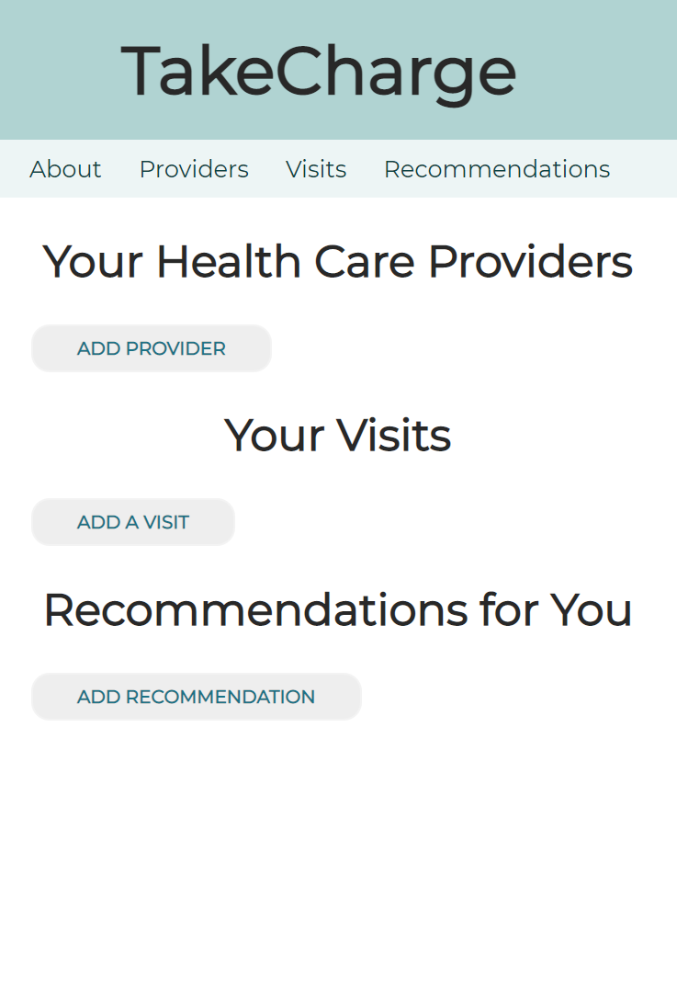

#TakeCharge

TakeCharge is a health care based React app that aims to provide patients  a way to be in control of their health. Patient portals, such as MyChart only work if:

1) All of the patient’s providers work within that same health system
2) The patient is tech savvy
3) The patient is cognitively intact and health literate.

TakeCharge allows patients to save and manage information related to their health care providers, visits, and recommendations in a way that THEY can understand. The patient, their caregiver, or their healthcare provider can quickly type the information into designated areas throughout the app, using only language that is appropriate for the patient. As a simple, user-friendly app, patients can keep this information easily accessible at their fingertips.

### Technology Used:
* HTML
* CSS
* JavaScript
* ReactJS
* NodeJS
* PostgreSQL